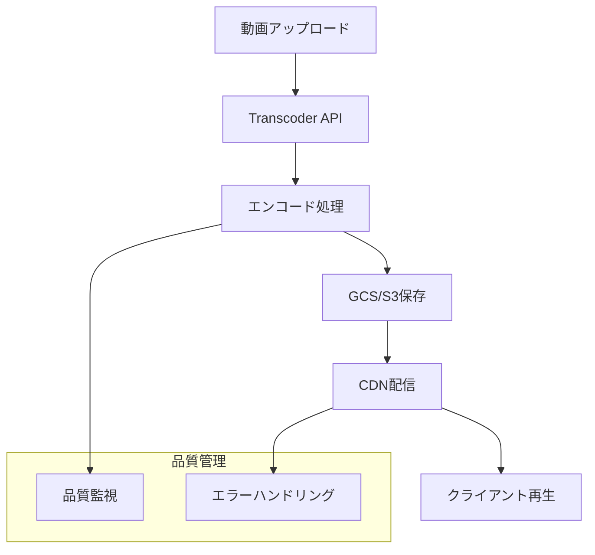

# Web動画配信フォーマット選択とストリーミング実装ガイド

動画配信サービスを構築する際、どのようなフォーマットを選択し、どのように実装すべきか迷うことがあります。本記事では、Web動画配信における主要なフォーマットの特徴と、要件に応じた最適な実装方法を解説します。

## 主要な配信フォーマット

### MP4（Progressive Download）

MP4は最も汎用的な動画フォーマットで、幅広いデバイスでサポートされています。

**特徴:**
- 単一ファイル形式
- シンプルな実装
- HTTP Rangeリクエストによる効率的な配信
- 任意の位置からの再生開始（シーク）が可能

**適用場面:**
- 解像度が単一で十分な場合
- シンプルな実装を求める場合
- 幅広いデバイス対応が必要な場合

### HLS（HTTP Live Streaming）

Appleが開発したストリーミング形式で、動画をセグメントに分割して配信します。

**特徴:**
- セグメントベースの配信（通常2-10秒）
- アダプティブストリーミング対応
- 複数の品質レベルを提供
- ネットワーク状況に応じた自動品質調整

**適用場面:**
- 複数解像度での配信が必要
- ネットワーク環境が不安定なユーザーへの対応
- ライブストリーミング

### MPEG-DASH

Dynamic Adaptive Streaming over HTTPの略で、複数の品質でセグメント化された動画を配信する国際標準規格です。

**特徴:**
- 国際標準規格
- HLSと同様のアダプティブストリーミング
- より柔軟な設定が可能

## 要件別の実装方針

| 要件 | 推奨フォーマット | 実装方法 |
|------|-----------------|----------|
| 動画を加工せず配信 | MP4 | GCS保存 + CDN配信 |
| 単一解像度・DRMなし | MP4 | Transcoder API変換 + GCS + CDN |
| 複数解像度・DRMなし | HLS | Transcoder API変換 + GCS + CDN |
| DRM付き配信 | HLS（暗号化） | 外部DRMサービス利用 |

## MP4配信の実装詳細

### HTTP Rangeリクエストによる効率的な配信

MP4配信では、HTTP Rangeリクエストを活用することで効率的な配信が可能です。

**メリット:**
- 必要なデータのみを取得（帯域幅節約）
- 高速な再生開始
- 任意位置からの再生開始

### MP4ファイル構造と配信時の注意点

MP4ファイルは以下の構造を持っています：

1. **ftyp（File Type Box）**: ファイルタイプや互換性情報
2. **moov（Movie Box）**: 動画全体の構造やメタデータ
3. **mdat（Media Data Box）**: 実際の動画・音声データ

**重要な注意点:**
- `moov`ボックスがファイル末尾にある場合、再生開始に時間がかかる
- 配信前に`moov`ボックスをファイル先頭に移動させる処理が推奨

```bash
# FFmpegを使用してmoovボックスを先頭に移動
ffmpeg -i input.mp4 -movflags faststart -c copy output.mp4
```

## HLS配信の実装詳細

### ファイル構造

HLSは以下のファイル群で構成されます：

- **マスタープレイリスト（.m3u8）**: 利用可能な品質のリスト
- **メディアプレイリスト（.m3u8）**: 各品質のセグメントリスト
- **セグメントファイル（.ts/.fmp4）**: 実際の動画データ

### マスタープレイリストの例

```m3u8
#EXTM3U
#EXT-X-VERSION:3
#EXT-X-STREAM-INF:BANDWIDTH=1280000,RESOLUTION=854x480
480p.m3u8
#EXT-X-STREAM-INF:BANDWIDTH=2560000,RESOLUTION=1280x720
720p.m3u8
#EXT-X-STREAM-INF:BANDWIDTH=5120000,RESOLUTION=1920x1080
1080p.m3u8
```

### メディアプレイリストの例

```m3u8
#EXTM3U
#EXT-X-VERSION:3
#EXT-X-TARGETDURATION:10
#EXTINF:9.009,
segment_0.ts
#EXTINF:9.009,
segment_1.ts
#EXTINF:9.009,
segment_2.ts
#EXT-X-ENDLIST
```

## DRM実装について

動画コンテンツの保護が必要な場合、DRM（Digital Rights Management）の導入を検討します。

### 主要なDRMソリューション

- **Widevine DRM（Google）**: 最も広く採用されているDRMソリューション
- **PlayReady（Microsoft）**: Microsoft製品との親和性が高い
- **FairPlay（Apple）**: Apple製品専用

### DRM導入の課題

- パートナー契約が必要
- 実装の複雑さ
- ライセンス費用
- 対応デバイスの制限

### 実装の選択肢

1. **自社実装**: 技術的ハードルが非常に高い
2. **外部サービス利用**: AWS Elemental MediaConvert、Vimeoなど
3. **マルチDRMソリューション**: BuyDRM、EZDRM など

## 実装時のベストプラクティス

### 配信インフラ設計



### パフォーマンス最適化

1. **CDN活用**: 世界中のエッジサーバーからの配信
2. **キャッシュ戦略**: 適切なCache-Controlヘッダー設定
3. **プリロード**: 重要なセグメントの事前読み込み
4. **帯域幅監視**: リアルタイムでの品質調整

### セキュリティ対策

- **アクセス制御**: 認証されたユーザーのみアクセス可能
- **Hotlink防止**: 不正な埋め込みの防止
- **地域制限**: 地域に応じたコンテンツ制御
- **トークンベース認証**: 一時的なアクセストークンの発行

## まとめ

動画配信システムの実装における要点：

1. **要件に応じたフォーマット選択**
   - シンプル配信: MP4
   - 複数解像度: HLS/DASH
   - コンテンツ保護: DRM付きHLS

2. **MP4配信時の注意点**
   - `moov`ボックスの位置最適化
   - HTTP Rangeリクエスト対応

3. **HLS配信の利点**
   - アダプティブストリーミング
   - ネットワーク状況への自動適応

4. **DRM導入**
   - 技術的ハードルの高さを考慮
   - 外部サービスの活用を検討

動画配信システムは要件によって最適な実装方法が大きく異なります。シンプルな配信から始めて、必要に応じて段階的に高度な機能を追加することを推奨します。
