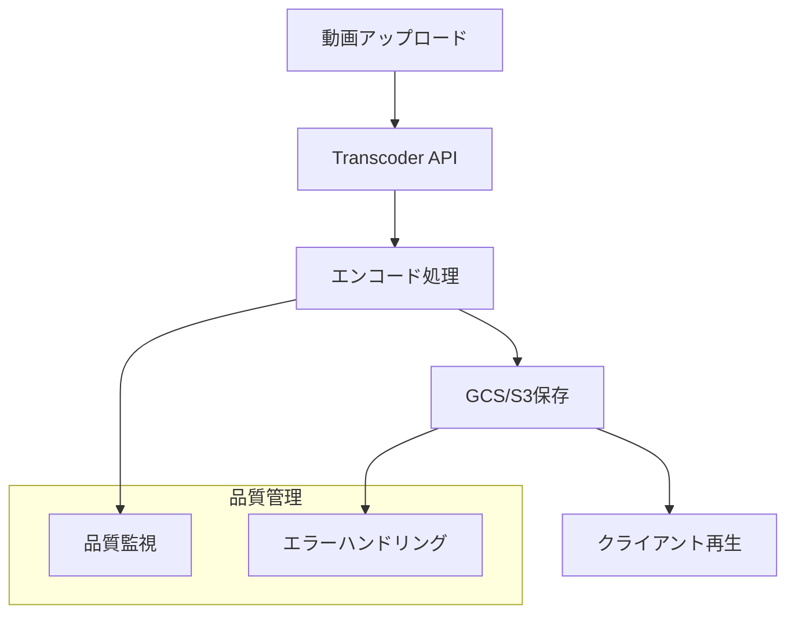

# Web動画配信フォーマット選択とストリーミング実装ガイド

Webで動画を届けたいとき、どの技術を選ぶべきか迷いませんか？

**「MP4、HLS、MPEG-DASH...たくさんあるけど、何が違うの？」**

動画配信は一見シンプルに見えますが、要件によって最適解は大きく異なります。本記事では、実践的な観点から**要件に応じた技術選択と実装方法**を解説します。

## 技術選択の基本的な考え方

動画配信の技術選択は、**目的・コスト・複雑さのトレードオフ**を考慮することが重要です：

- **シンプルさとコストを重視** → MP4
- **いろんな環境で最高の体験** → HLS/MPEG-DASH  
- **コンテンツ保護が絶対必要** → DRM（ただし外部サービス利用が現実的）

それぞれの特徴を詳しく見ていきましょう。

## 1. MP4（Progressive Download）- 手軽で確実な選択

**「まずは確実に動くものを作りたい」**

MP4は単一ファイルで管理が楽で、コストも最も低い選択肢です。MVP開発や社内研修動画など、単一解像度で十分な場合にはとても良い選択肢となります。

### 技術的特徴

- **単一ファイル形式**により管理が簡単
- **HTTP Rangeリクエスト**対応で必要な部分のみダウンロード
- **任意位置からの再生開始**（シーク機能）をネイティブサポート
- **実装の簡潔性**で開発工数を大幅に削減

### 専門家が教える重要な注意点

**moovボックスの位置に注意！**

MP4ファイル内には「moovボックス」というメタ情報があります。これがファイルの最後に記録されていると、再生開始に必要な情報を読むために、結局ファイル全体をある程度ダウンロードしないといけません。

**解決策**: 配信前にFFmpegで以下の処理を実行

```bash
# moovボックスをファイル先頭に移動（体感速度が全然違います）
ffmpeg -i input.mp4 -movflags faststart -c copy output.mp4
```

この一手間をかけるだけで、再生開始が大幅に高速化されます。

### 最適な利用シーン
- 社内研修動画、製品説明動画
- 個人ブログの動画コンテンツ
- MVP段階の動画配信機能

## 2. HLS（HTTP Live Streaming）- 柔軟性と品質を両立

**「ユーザーの回線速度に合わせて最適な画質を自動調整したい」**

Appleが開発したHLSは、Netflix、YouTubeなどの大手動画配信サービスでも採用されています。動画を短いセグメント（通常2-10秒）に分割して、ユーザーの回線速度に合わせて画質を自動調整する**アダプティブストリーミング**が最大の特徴です。

### HLSの仕組みを理解する

HLSは複数のファイルが連携して動作します：

#### 1. マスタープレイリスト（.m3u8）
利用できる画質（480p、720p、1080p など）の一覧表。クライアントはまずこのファイルを読み込み、現在のネットワーク状況に最適な品質を選択します。

```m3u8
#EXTM3U
#EXT-X-VERSION:3
# 480p品質：1.28Mbps
#EXT-X-STREAM-INF:BANDWIDTH=1280000,RESOLUTION=854x480
480p.m3u8
# 720p品質：2.56Mbps  
#EXT-X-STREAM-INF:BANDWIDTH=2560000,RESOLUTION=1280x720
720p.m3u8
# 1080p品質：5.12Mbps
#EXT-X-STREAM-INF:BANDWIDTH=5120000,RESOLUTION=1920x1080
1080p.m3u8
```

#### 2. メディアプレイリスト（.m3u8）
選択した品質レベルごとに存在し、具体的なセグメントファイルの一覧を提供。

```m3u8
#EXTM3U
#EXT-X-VERSION:3
#EXT-X-TARGETDURATION:10
#EXTINF:9.009,
segment_0.ts
#EXTINF:9.009,
segment_1.ts
#EXT-X-ENDLIST
```

#### 3. セグメントファイル（.ts）
実際の動画データ。2〜10秒程度に分割された短い動画ファイル。

### なぜ途切れにくいのか？

プレイヤーは常に最適な品質を選び続けるため、スムーズな再生体験を実現できます。ライブ配信にも対応できる柔軟性があります。

### 実装時の考慮点

MP4に比べると：
- **ファイル数が増える**（管理が複雑）
- **エンコードとストレージの管理**が複雑
- **サーバー側の負荷**を考慮が必要

柔軟性と実装・運用コストを天秤にかける必要があります。

### 最適な利用シーン
- 動画配信プラットフォーム（多様なデバイス対応）
- ライブ配信サービス（ウェビナー、ライブコマース）
- モバイルユーザーが多いサービス（通信量最適化が重要）

## 3. MPEG-DASH - オープンな国際標準規格

**「特定のプラットフォームに縛られたくない」**

Dynamic Adaptive Streaming over HTTPは、ISOが策定した国際標準規格です。HLSがApple主導で発展したのに対し、MPEG-DASHは業界全体のコンセンサスを得た、よりオープンな規格として位置づけられています。

### 技術的特徴
- **国際標準規格**としての技術的信頼性
- **プラットフォーム中立**で特定ベンダーに依存しない
- **より柔軟な設定オプション**で細かい制御が可能
- **HLSと同等のアダプティブストリーミング機能**

### プラットフォームごとの相性

**Android**: 標準でDASHをサポート  
**iOS**: HLSがネイティブサポート（DASHはアプリ側での対応が必要）

このようなプラットフォームの相性やオープンさが選択のポイントになります。

### 最適な利用シーン
- エンタープライズ系システム（標準準拠が重要）
- 長期運用を前提としたシステム（将来的な互換性確保）
- Android中心のサービス（ネイティブサポートの活用）

---

## 実装戦略：要件別のアプローチ

実際に実装するとなったら、どういう戦略を取るべきでしょうか？よく遭遇するパターンを4つに整理しました。

### シンプル配信：MP4
**要件**: アップロードした動画をそのまま配信  
**アプローチ**: GCS/S3保存  
**適用例**: 社内研修動画、製品説明動画

### 標準配信：MP4 + トランスコーダー
**要件**: 配信に適した形式に変換したいが、解像度は1種類で十分  
**アプローチ**: Transcoder API変換 + GCS/S3  
**適用例**: Webサイトの埋め込み動画、ECサイトの商品紹介動画

### アダプティブ配信：HLS/DASH + トランスコーダー
**要件**: デバイスや回線速度に応じて最適な画質を提供  
**アプローチ**: Transcoder API変換（複数解像度） + GCS/S3  
**適用例**: 動画配信プラットフォーム、オンライン学習システム

### セキュア配信：DRM + HLS + 外部サービス
**要件**: コンテンツの不正コピーや流出を防ぎたい  
**アプローチ**: 外部DRMサービス利用  
**適用例**: 有料動画配信、企業の機密情報を含む研修コンテンツ

---

## DRMの現実的な話

**「有料コンテンツを保護したいけど、どうすればいい？」**

DRM（Digital Rights Management）は、有料コンテンツや機密情報を含む動画では重要な技術です。しかし、実装のハードルが非常に高いのが現実です。

### 主要DRM技術と課題

**Widevine（Google）**: 最も幅広く採用、Chrome/Firefox/Edgeなどでサポート  
**PlayReady（Microsoft）**: Windows環境やEdgeでのサポートが充実  
**FairPlay（Apple）**: Safari・iOS/macOS専用

### なぜ自社実装が現実的でないのか？

- **パートナー契約の必要性**: GoogleやMicrosoftとの直接契約は中小企業には困難
- **実装の技術的複雑さ**: 専門知識が必要で、開発・保守コストが高い
- **ライセンス費用**: 継続的なコストが発生

### 現実的なアプローチ

**外部サービスの利用が最適解**

- **AWS Elemental MediaConvert**: DRM保護を含めた動画配信機能をパッケージで提供
- **Vimeo、JW Player**: 統合された動画配信プラットフォーム
- **BuyDRM、EZDRM**: マルチDRMソリューションの専門サービス

**重要な判断基準**: どのレベルのセキュリティが本当に必要なのか、そのためのコストと複雑さを受け入れられるのかというバランスです。

---

## 実装時のベストプラクティス

### スケーラブルな配信インフラの設計



### 実際の実装で気をつけるポイント

1. **エンコード品質の設定**: 用途に応じた適切なビットレート設定
2. **監視・アラート**: 配信状況の継続的なモニタリング
3. **コスト管理**: ストレージと転送量の最適化

---


## おわりに

本記事では、Web動画配信の技術選択について実践的な観点から解説しました。

**重要なポイント**：
- **目的・コスト・複雑さのトレードオフ**を常に意識する
- **要件を明確にしてから技術選択**する  
- **外部サービスの活用**も現実的な選択肢として検討する

動画配信は奥が深い技術領域ですが、要件に応じた適切な選択をすることで、効果的なシステムを構築できます。
