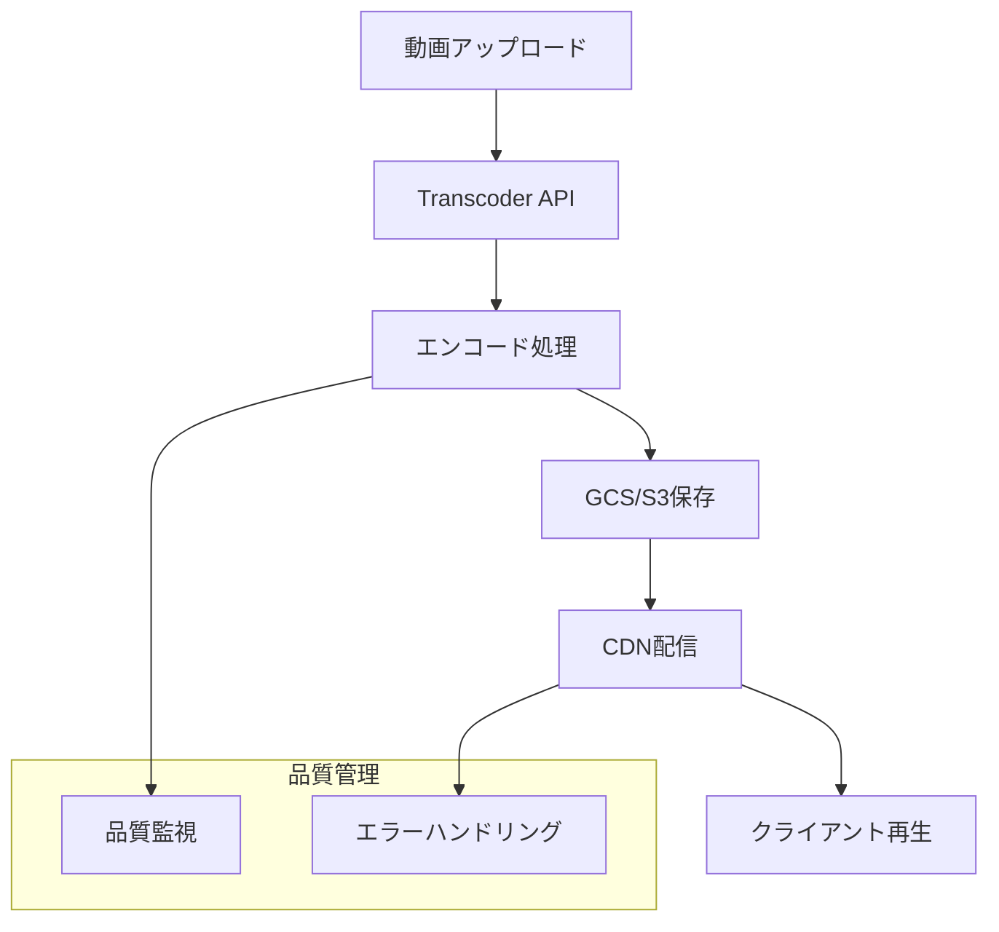

# Web動画配信フォーマット選択とストリーミング実装ガイド

現代のWebアプリケーションにおいて、動画配信機能の需要は急速に高まっています。しかし、「どのフォーマットを選ぶべきか」「どう実装すれば効率的か」といった技術選択で悩む開発者は少なくありません。

本記事では、実際のプロジェクトで直面する動画配信の課題を踏まえ、MP4からHLS、DRMまでの主要なフォーマットと実装方法を、具体的なユースケースとともに解説します。動画配信システムの構築を検討している方、既存システムの改善を考えている方に実践的な指針をお届けします。

## 主要な配信フォーマット比較

動画配信システムを構築する際、まず理解すべきは各フォーマットの特性と適用場面です。ここでは実際のプロジェクトでよく使われる3つの主要フォーマットについて詳しく解説します。

### MP4（Progressive Download）- シンプルで確実な選択

MP4は動画配信の「スタンダード」とも言える存在で、ほぼすべてのデバイスとブラウザで再生可能です。特に企業の研修動画配信や製品紹介動画など、確実な再生が求められる場面で優れた性能を発揮します。

**技術的特徴：**
- **単一ファイル形式**により管理が簡単
- **HTTP Rangeリクエスト**に対応し、必要な部分のみダウンロード
- **任意位置からの再生開始**（シーク機能）をネイティブサポート
- **実装の簡潔性**で開発工数を大幅に削減

**最適な利用シーン：**
- 教育コンテンツやチュートリアル動画（要件に応じて単一解像度も選択可能）
- 企業内研修システム（幅広いデバイス対応が必須）
- MVP段階の動画配信機能（まずは確実に動くものを）
- 小規模なWebサイトでの動画埋め込み

### HLS（HTTP Live Streaming）- 柔軟性と品質を両立

Appleが開発したHLSは、動画を小さなセグメント（通常2-10秒）に分割して配信する方式です。Netflix、YouTubeなどの大手動画配信サービスでも採用されており、ユーザー体験の向上に大きく貢献しています。

**技術的特徴：**
- **アダプティブストリーミング**により、ユーザーの回線速度に応じて自動で画質調整
- **セグメント化**により、バッファリングを最小限に抑制
- **複数品質レベル**の同時配信で、幅広いデバイスに最適化
- **ライブ配信にも対応**し、リアルタイム性が要求される用途にも適用可能

**最適な利用シーン：**
- 動画配信プラットフォーム（多様なデバイスとネットワーク環境への対応）
- ライブ配信サービス（ウェビナー、ライブコマース等）
- モバイルユーザーが多いサービス（通信量の最適化が重要）
- グローバル展開を見据えたサービス（地域ごとの回線品質差への対応）

### MPEG-DASH - 標準規格の安心感

Dynamic Adaptive Streaming over HTTPは、ISOが策定した国際標準規格です。HLSがApple主導で発展したのに対し、MPEG-DASHは業界全体のコンセンサスを得た仕様として位置づけられています。

**技術的特徴：**
- **国際標準規格**としての技術的信頼性
- **プラットフォーム中立**で、特定ベンダーに依存しない
- **より柔軟な設定オプション**により、細かい制御が可能
- **HLSと同等のアダプティブストリーミング機能**

**最適な利用シーン：**
- エンタープライズ系システム（標準準拠が重要な要件）
- 長期運用を前提としたシステム（将来的な互換性確保）
- Android中心のサービス（ネイティブサポートの活用）

## 要件別の実装戦略

動画配信システムの要件は多岐にわたりますが、実際のプロジェクトでよく遭遇するパターンを整理すると、以下の4つの典型的なケースに分類できます。それぞれのケースにおける最適なアプローチについて詳しく解説します。

### シンプル配信（加工なし）
**要件：** アップロードした動画をそのまま配信したい  
**推奨フォーマット：** MP4  
**実装アプローチ：** GCS/S3保存 + CDN配信  
**適用例：** 社内研修動画、製品説明動画、個人ブログの動画コンテンツ

### 標準配信（単一解像度）
**要件：** 配信に適した形式に変換したいが、解像度は1種類で十分  
**推奨フォーマット：** MP4  
**実装アプローチ：** Transcoder API変換 + GCS/S3 + CDN  
**適用例：** Webサイトの埋め込み動画、ECサイトの商品紹介動画

### アダプティブ配信（複数解像度）
**要件：** デバイスや回線速度に応じて最適な画質を提供したい  
**推奨フォーマット：** HLS  
**実装アプローチ：** Transcoder API変換 + GCS/S3 + CDN  
**適用例：** 動画配信プラットフォーム、オンライン学習システム、ライブ配信

### セキュア配信（DRM保護）
**要件：** コンテンツの不正コピーや流出を防ぎたい  
**推奨フォーマット：** HLS（暗号化対応）  
**実装アプローチ：** 外部DRMサービス利用  
**適用例：** 有料動画配信、企業の機密情報を含む研修コンテンツ

## MP4配信の実装詳細

### HTTP Rangeリクエストによる効率的な配信

MP4配信では、HTTP Rangeリクエストを活用することで効率的な配信が可能です。

**メリット:**
- 必要なデータのみを取得（帯域幅節約）
- 高速な再生開始
- 任意位置からの再生開始

### MP4ファイル構造と配信時の注意点

MP4ファイルは以下の構造を持っています：

1. **ftyp（File Type Box）**: ファイルタイプや互換性情報
2. **moov（Movie Box）**: 動画全体の構造やメタデータ
3. **mdat（Media Data Box）**: 実際の動画・音声データ

**重要な注意点:**
- `moov`ボックスがファイル末尾にある場合、再生開始に時間がかかる
- 配信前に`moov`ボックスをファイル先頭に移動させる処理が推奨

```bash
# FFmpegを使用してmoovボックスを先頭に移動
ffmpeg -i input.mp4 -movflags faststart -c copy output.mp4
```

## HLS配信の実装詳細

HLSはシンプルなMP4とは異なり、複数のファイルが連携して動作する、より高度なシステムです。その仕組みを理解することで、適切な実装とデバッグが可能になります。

### HLSのファイル構造と関係性

HLSでは以下の3種類のファイルが連携して動作します：

**マスタープレイリスト（.m3u8）**は、動画の「目次」のような役割を果たし、利用可能なすべての品質レベル（480p、720p、1080pなど）を一覧できます。クライアントはまずこのファイルを読み込み、現在のネットワーク状況に最適な品質を選択します。

**メディアプレイリスト（.m3u8）**は、各品質レベルごとに存在し、その品質の動画を構成する具体的なセグメントファイルの一覧を提供します。

**セグメントファイル（.tsまたは.fmp4）**は、実際の動画データを格納し、通常2～10秒程度の短い時間単位で分割されています。この細かい分割が、ネットワーク状況の変化に素早く対応できる秘訣です。

### 実際のプレイリストファイルの構造例

以下は実際のプロジェクトで使用されるプレイリストファイルの例です。これらのファイルは、動画変換ツールによって自動生成されますが、構造を理解しておくことでデバッグ時に役立ちます。

**マスタープレイリストの例：**
```m3u8
#EXTM3U
#EXT-X-VERSION:3
# 480p品質：1.28Mbps、854x480解像度
#EXT-X-STREAM-INF:BANDWIDTH=1280000,RESOLUTION=854x480
480p.m3u8
# 720p品質：2.56Mbps、1280x720解像度
#EXT-X-STREAM-INF:BANDWIDTH=2560000,RESOLUTION=1280x720
720p.m3u8
# 1080p品質：5.12Mbps、1920x1080解像度
#EXT-X-STREAM-INF:BANDWIDTH=5120000,RESOLUTION=1920x1080
1080p.m3u8
```

**メディアプレイリストの例（720p.m3u8）：**
```m3u8
#EXTM3U
#EXT-X-VERSION:3
#EXT-X-TARGETDURATION:10  # セグメントの最大長
#EXTINF:9.009,           # 実際のセグメント長
segment_0.ts
#EXTINF:9.009,
segment_1.ts
#EXTINF:9.009,
segment_2.ts
#EXT-X-ENDLIST           # ライブではないVODコンテンツの終了マーカー
```

これらのファイルは、CDN上に適切なキャッシュ設定で配置され、クライアントからのリクエストに応じて動的に品質が選択されます。

## DRM実装の現実的な考え方

動画コンテンツの不正コピーや流出を防ぐDRM（Digital Rights Management）は、有料コンテンツや機密情報を含む動画では重要な技術です。しかし、実装の複雑さとコストを考慮し、慎重な検討が必要です。

### 主要DRMソリューションの特徴と選択指針

**Widevine DRM（Google）**は現在最も幅広く採用されており、Chrome、Firefox、Edgeなどの主要ブラウザでサポートされています。Androidデバイスでのサポートも網羅的で、グローバルなサービスでは第一選択肢となることが多いでしょう。

**PlayReady（Microsoft）**はWindows環境やInternet Explorer/Edgeでのサポートが充実しており、企業内システムやMicrosoftエコシステム中心の環境で力を発揮します。

**FairPlay（Apple）**はSafariやiOS/macOSデバイス専用ですが、Appleユーザーの多いサービスでは必須と言えるでしょう。

### DRM導入時に直面する現実的な課題

最も大きな障壁は、**パートナー契約の必要性**です。GoogleやMicrosoftとの直接契約は中小企業にとって現実的ではなく、実装の技術的複雑さも独自対応を困難にしています。さらに、ライセンス費用や対応デバイスの制限も、サービス設計に大きな影響を与えます。

### 現実的な実装アプローチ

**自社実装**は技術的ハードルが非常に高く、現実的ではありません。ほとんどの場合、**外部サービスの利用**が最適解となります。

AWS Elemental MediaConvert、Vimeo、JW Playerなどのプラットフォームでは、DRM保護を含めた動画配信機能をパッケージで提供しています。また、BuyDRM、EZDRMなどの**マルチDRMソリューション**では、複数のDRMシステムを統合管理できるサービスを提供しています。

コストと機能のバランスを考慮し、まずはこれらのサービスを用いてプロトタイプを作成し、必要に応じて段階的に機能を拡充するアプローチが推奨されます。

## 実装時のベストプラクティス

動画配信システムの構築では、単にフォーマットを選択するだけでなく、インフラ設計、パフォーマンス最適化、セキュリティ対策の総合的な視点が重要です。以下では、実際のプロジェクトで効果が実証された実践的なアプローチをご紹介します。

### スケーラブルな配信インフラの設計



### パフォーマンス最適化の実践ポイント

動画配信において、ユーザー体験を左右する最も重要な要素がパフォーマンスです。**CDNの積極的な活用**により、世界中のエッジサーバーから最寄りのユーザーへ配信することで、レイテンシを大幅に削減できます。

**キャッシュ戦略の最適化**では、動画ファイルやプレイリストファイルに適切なCache-Controlヘッダーを設定し、不要なサーバーアクセスを削減します。特にHLSでは、セグメントファイルは長期間キャッシュ可能ですが、プレイリストファイルは比較的短時間での更新が必要です。

**インテリジェントなプリロード機能**により、ユーザーの視聴パターンを分析して重要なセグメントを事前読み込みし、途切れのない再生体験を実現します。また、**リアルタイム帯域幅監視**によって、ネットワーク状況に応じて動的に品質を調整し、バッファリングを最小限に抑制します。

### 多層防御によるセキュリティ対策

動画配信システムでは、コンテンツの価値保護とサービスの安定運用の両面でセキュリティ対策が重要です。

**アクセス制御の実装**では、認証されたユーザーのみが動画にアクセスできるよう、JWT トークンや一時的なURLを活用した認証システムを構築します。**Hotlink防止機能**により、不正なサイトへの動画埋め込みを防ぎ、帯域幅の無駄遣いとコンテンツの無断利用を阻止します。

**地域制限機能**では、IPアドレスベースの地域判定により、配信地域を適切に制御し、ライセンス要件やコンプライアンス要求に対応します。さらに、**トークンベース認証**の導入により、一定時間で無効になるアクセストークンを発行し、セキュリティを高めつつユーザビリティを維持します。

## おわりに

本記事では、Web動画配信システムの構築において重要な技術選択とその実装方法について、実践的な観点から解説しました。

**フォーマット選択の判断基準**として、シンプルな配信要件であればMP4、多様なデバイスや回線環境への対応が必要であればHLS、コンテンツ保護が重要であればDRM付きHLSというように、ビジネス要件と技術的制約を総合的に評価することが重要です。

**段階的な実装アプローチ**をおすすめします。まずはMP4による基本的な動画配信機能でMVPを構築し、ユーザーの反応やトラフィック状況を見ながら、HLSによるアダプティブストリーミングやDRMによるコンテンツ保護など、より高度な機能を段階的に追加していく戦略が、リスクを最小化しながら価値を最大化する現実的なアプローチです。

動画配信技術は急速に進歩していますが、本記事で紹介した基本的な考え方と実装パターンは、今後も長く通用する普遍的な知識です。技術選択に迷った際は、常にユーザー体験とビジネス価値を中心に据えて判断することが、成功への近道となるでしょう。
