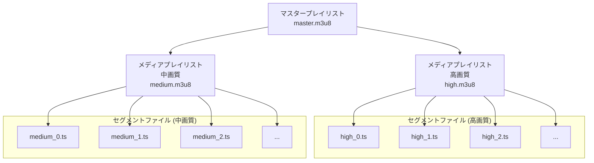

# 動画再生Tips
## 今井陽介
---
layout: default
hideInToc: true
css: style.css
---

# 目次

<Toc text-sm minDepth="1" maxDepth="2" />

---
layout: default
transition: fade-out
title: 概要
---
# 動画配信といっても考慮することは多い
- 解像度は複数 or 単一
- リソースの有無
- 暗号化の有無
---
layout: default
transition: fade-out
title: 配信フォーマット
---

# 配信フォーマット

Webサービスで動画配信する場合、いくつかフォーマットはありますが主にHLS,mp4, MPEG-DASHが主な選択肢になります。

### HLS

HTTP Live Streaming。Appleが開発したストリーミング形式。セグメントに分割された動画を配信。

### MP4（単一フォーマット）
単一ファイル形式で、幅広いデバイスでサポートされる汎用的なフォーマット。

### MPEG-DASH
何か説明文
---
layout: default
title: 対応方針
---
# 対応方法
配信サーバーなども自前で実装するか、外部サービスと契約して埋め込むか

### 自前実装
外部サービスを使わずに自前で全て実装します。
要件によっては配信サーバーや変換サーバーの構築が必要です。

### 外部サービス
外部サービスを利用します。
上述した配信サーバーや変換サーバーは外部サービス側で処理してくれます。
SDKやiframeで自サービスに組み込みます。

---
layout: default
title: 要件別対応方針
---
# 要件別の対応方針
### MP4を自前で配信
- 配信の解像度が単一
- 暗号化する必要ない

### HLS（DRMなし）を自前で配信
- 配信する解像度が複数あり、視聴環境によって解像度を動的に変える
- 暗号化の必要なし  or AES-128方式での暗号化だけでいい

### 外部サービス
- HLSの配信環境を構築するのしんどい
- DRM（デジタル著作権管理）に対応が必要

### 諦める
- DRMも必要だし、社内申請も通らない
- DRM認証サーバーを構築するか、DRM提供元とライセンス契約を行う必要がある

---
layout: default
title: MP4の配信方法
---
# MP4の配信方法
解像度について特に言及がなければMP4の単一ファイルを配信する方法で良いと思います。

### **HTTP Rangeリクエストを使用した配信**
- Rangeリクエストとは、HTTPプロトコルの範囲指定機能で、ファイル全体ではなく特定のバイト範囲だけを取得するリクエストです。
- 動画再生時、クライアントは動画の必要な部分（例えば、再生開始位置やシーク位置）を指定してサーバーからデータを取得します。

**Rangeリクエストの例：**
```http
GET /video.mp4 HTTP/1.1
Host: example.com
Range: bytes=0-1048575
```

- 必要なデータのみを効率的に取得できるため、帯域幅の節約や高速再生が可能。
- 動画の任意の位置（シーク位置）から再生を開始できる。

---
layout: default
title: MP4のファイル構造と注意点
---
### **MP4ファイルの構造と配信の関係**
MP4ファイルは、以下のような構造を持っています。
1. **ftyp（File Type Box）**：ファイルタイプや互換性情報
2. **moov（Movie Box）**：動画全体の構造やメタデータ
3. **mdat（Media Data Box）**：実際の動画や音声データ

### **配信における注意点**
**moovボックスの位置**
- mdatボックスの後ろにある場合、最初にmoovを取得するために全ファイルをダウンロードする必要が生じ、再生の遅延が発生します。
- moovの位置を先頭に移動させるために再度変換処理が必要です。

---
layout: default
title: HLSの配信方法
---
# HLSの配信方法
HLSはAdaptive Streamingを実現するためのストリーミングプロトコルです。

### **セグメントベースのストリーミング**
- 動画を短い時間（通常2〜10秒）のセグメントに分割し、各セグメントは個別のファイルとして配信されます。
- マニフェストファイル（.m3u8）が全セグメントの場所と再生順序を管理します。

### **特徴として**
- 異なる帯域幅に対応する複数の品質レベルを提供することが可能です。
- クライアントは自動的にネットワーク状況に応じて最適な品質を選択できます。

---
layout: default
title: HLSのファイル構造と注意点
---
### **HLSの構造**
HLSは、以下のようなファイル構造を持っています。
- **マスタープレイリスト**: 利用可能な品質（解像度・ビットレート）のリスト
- **メディアプレイリスト**: 各品質ストリームのセグメントリスト
- **セグメントファイル**: 実際の動画データ（通常.tsまたは.fmp4形式）




---
layout: end
---
ご清聴ありがとうございました