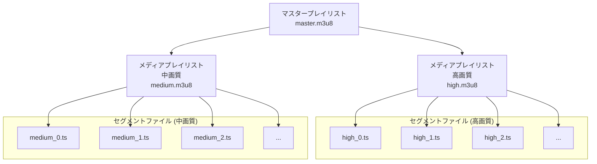

# VOD配信を実装するためのTips
## 今井陽介
---
layout: default
hideInToc: true
title: 概要
---
# 概要

Web動画配信を実装する際に知っておきたい主要なポイントを解説します：

- 動画配信フォーマットの種類と選定基準
- 要件に応じた実装アプローチ
- MP4配信のメリットと実装時の注意点
- HLSによるアダプティブストリーミングの実現方法
- 動画コンテンツ保護のためのDRM概要

---
layout: default
hideInToc: true
css: style.css
---

# 目次

<Toc text-sm minDepth="1" maxDepth="2" />

---
layout: default
title: 配信フォーマット
---

# 配信フォーマット

Webサービスで動画配信する場合、いくつかフォーマットはありますが主にHLS,mp4, MPEG-DASHが主な選択肢になります。

### **MP4（単一フォーマット）**
単一ファイル形式であり、幅広いデバイスでサポートされている汎用的なフォーマットです。
 

### **HLS**
HTTP Live Streaming。Appleが開発したストリーミング形式で、動画をセグメントに分割して配信します。

 

### **MPEG-DASH**
Dynamic Adaptive Streaming over HTTPの略。複数の品質でセグメント化された動画を配信する国際標準規格です。
---
layout: default
title: 要件別対応方針
---
# 要件別の対応方針
| 要件 | 対応方針 | 実装方法 |
|------|---------|---------|
| 動画を加工せず配信 | MP4をそのまま配信 | - GCSに保存 - CDNで配信 |
| 動画を加工して配信（解像度は単一・DRMなし） | 動画をMP4に変換して配信 | - Transcoder APIで動画変換 - GCSに保存 - CDNで配信 |
| 動画を加工して配信（解像度は複数・DRMなし） | HLSに変換して複数解像度で配信 | - Transcoder APIで動画変換 - GCSに保存 - CDNで配信 |
| 動画を加工して配信（DRMあり） | 暗号化してHLS配信（DRM認証付き） | - DRMサポート付き外部サービスを利用 - 自プロジェクトに組み込み |
---
layout: default
title: MP4の配信方法
---
# MP4の配信方法
解像度について特別な要件がなければ、MP4の単一ファイルを配信する方法が適しています。

### **HTTP Rangeリクエストを使用した配信**
- Rangeリクエストとは、HTTPプロトコルの範囲指定機能で、ファイル全体ではなく特定のバイト範囲だけを取得するリクエストです。
- 必要なデータのみを効率的に取得できるため、帯域幅の節約や高速再生が可能。
- 動画の任意の位置（シーク位置）から再生を開始できる。

---
layout: default
title: MP4のファイル構造と注意点
---
### **MP4ファイルの構造と配信の関係**
MP4ファイルは、以下のような構造を持っています。
1. **ftyp（File Type Box）**：ファイルタイプや互換性情報
2. **moov（Movie Box）**：動画全体の構造やメタデータ
3. **mdat（Media Data Box）**：実際の動画や音声データ

 

### **配信における注意点**
**moovボックスの位置**
- mdatボックスの後ろにある場合、最初にmoovを取得するために全ファイルをダウンロードする必要が生じ、再生の遅延が発生します。
- moovの位置を先頭に移動させるために再度変換処理が必要です。

---
layout: default
title: HLSの配信方法
---
# HLSの配信方法
HLSはAdaptive Streamingを実現するためのストリーミングプロトコルです。

### **セグメントベースのストリーミング**
- 動画を短い時間（通常2〜10秒）のセグメントに分割し、各セグメントは個別のファイルとして配信されます。
- マニフェストファイル（.m3u8）が全セグメントの場所と再生順序を管理します。

 

### **特徴として**
- 異なる帯域幅に対応する複数の品質レベルを提供することが可能です。
- クライアントは自動的にネットワーク状況に応じて最適な品質を選択できます。

---
layout: default
title: HLSのファイル構造と注意点
---
### **HLSの構造**
HLSは、以下のようなファイル構造を持っています。
- **マスタープレイリスト**: 利用可能な品質（解像度・ビットレート）のリスト
- **メディアプレイリスト**: 各品質ストリームのセグメントリスト
- **セグメントファイル**: 実際の動画データ（通常.tsまたは.fmp4形式）
  

---
layout: default
title: DRMについて
---

# DRMについて

よくある動画配信サービス（HuluやNetfrixなど）はDRM（デジタル保護管理）の技術を使っています。
動画をダウンロードしたり、画面録画した場合でも黒塗りになるようDRM方式でデータを適切に暗号化しています。

### **DRMサービス**
一般的にはDRM認証サービスを導入します。
Googleが提供している[Widevine DRM](https://www.widevine.com/solutions/widevine-drm)が有名

### **導入方法として、**
ざっくり下記手順が必要となり、かなりハードルが高いです。[参考URL](https://www.multidrmkit.net/blog/how-to-widevine)
- Widevineパートナーになる
- Widevineの利用を開始する
- 動画を暗号化
---
layout: default
title: まとめ
---

# まとめ

### **配信フォーマットの選択**
- シンプルな配信はMP4
- 複数解像度対応にはHLS/DASH
- コンテンツ保護にはDRM導入を検討
 

### **MP4配信時**
「moovボックス」の位置に注意し、ファイル先頭配置を推奨

### **HLS配信**
ネットワーク状況に応じた最適な品質を提供可能

### **DRM導入**
技術的ハードルが高いので、外部サービスを検討

---
layout: end
---
ご清聴ありがとうございました